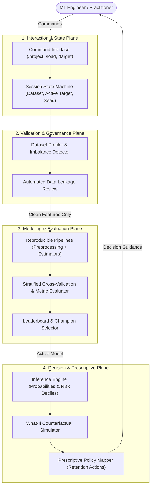
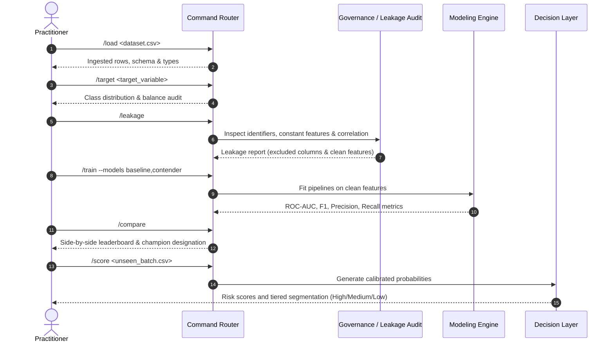

# Asuna ML Agent — Public Architecture Case Study

[](https://www.python.org/)
[](https://scikit-learn.org/)
[](https://pytest.org/)
[](#architecture-overview)

A public architecture case study, interaction design specification, and verified reference implementation for an applied machine learning lifecycle assistant.

---

## Important Repository Notice

> **Scope Clarification**: This repository is a public architecture case study and systems design document. It intentionally separates conceptual workflow design and public reference code from the private product engine.
>
> - **Private Engine Context**: The full Asuna engine is a private product containing proprietary agent orchestrators, multi-tenant model registries, custom drift mitigation triggers, and enterprise connectors.
> - **Public Repository Scope**: This repository provides the verifiable architectural blueprint, command protocol specifications, data leakage audit methodology, and **Asuna Lite** (`asuna-lite/`), a fully reproducible reference implementation with automated tests.
>
> *Asuna Lite is a deliberately reduced public reference implementation demonstrating selected workflow concepts. It is not the private Asuna engine.*

---

## 1. System Architecture

Asuna structures the predictive analytics lifecycle into four deterministic layers:



---

## 2. End-to-End Workflow Sequence

The system enforces strict sequence dependencies to guarantee reproducible outcomes and eliminate lookahead bias:



---

## 3. Design Decisions & Rationale

1. **Mandatory Pre-Training Leakage Audit**:
   - In tabular business problems, data leakage (e.g. including unique customer IDs, post-event timestamps, or proxy variables) produces deceptive evaluation metrics.
   - Asuna enforces an explicit `/leakage` checkpoint before fitting models, isolating target proxies and constant features automatically.

2. **Stratified Preprocessing Pipelines**:
   - Features are processed strictly within cross-validation folds using Scikit-Learn `ColumnTransformer` (StandardScaler for numericals, OneHotEncoder for categoricals) to prevent data snooping across splits.

3. **Probability Calibration & Tiered Decisioning**:
   - Rather than outputting raw binary classifications at fixed 0.5 thresholds, the workflow produces probability estimates mapped to business risk tiers (`High`, `Medium`, `Low`). This enables targeted operational interventions (e.g., proactive retention offers for high-risk accounts).

---

## 4. Asuna Lite — Public Reference Implementation

To provide verifiable code evidence, this repository includes [`asuna-lite/`](asuna-lite/):

- **Core Package**: `asuna_lite.workflow.AsunaLiteWorkflow`
- **Capabilities Verified**:
  - Synthetic tabular data generation (`generate_synthetic_telecom_data`)
  - Target assignment and class imbalance inspection
  - Automatic detection and exclusion of identifier columns and zero-variance features
  - Logistic Regression (baseline) vs. Random Forest (contender) comparison
  - Batch inference with calibrated probability and risk tier output
- **Automated Tests**: 100% passing test suite using `pytest` (`asuna-lite/tests/test_workflow.py`).

### Running Asuna Lite Locally
```bash
cd asuna-lite
pip install -r requirements.txt

# Run demonstration CLI
python -m asuna_lite.cli

# Run automated unit tests
pytest tests/ -v
```

---

## 5. Security & Privacy Rationale

- **No Proprietary Code Exposure**: Enterprise orchestration engines, database schemas, and private customer datasets are kept strictly outside public version control.
- **Synthetically Verified Tests**: All public unit tests and CLI demonstrations operate exclusively on deterministically generated synthetic data (`generate_synthetic_telecom_data`), guaranteeing zero leakage of proprietary or personally identifiable information (PII).
- **Clean Dependency Footprint**: Minimal external dependencies (`pandas`, `scikit-learn`, `pytest`) without unvetted third-party wrappers.

---

## 6. System Limitations

- **Tabular Scope**: Designed primarily for structured tabular classification and regression; unstructured audio, video, or raw text parsing requires separate preprocessing pipelines.
- **Reference Scalability**: `asuna-lite` executes in-memory; distributed dataset processing (e.g. Spark / Ray) is part of the private enterprise architecture.
- **Human in the Loop**: The assistant provides structured recommendations and audits; domain validation and feature interpretation remain the practitioner's responsibility.

---

## Documentation Directory

- [`docs/architecture.md`](docs/architecture.md): Conceptual architectural layers and module breakdown.
- [`docs/commands.md`](docs/commands.md): Command specification across project, validation, training, and business layers.
- [`docs/technical_scope.md`](docs/technical_scope.md): Included vs. excluded capabilities and system boundaries.
- [`docs/roadmap.md`](docs/roadmap.md): Evolution timeline and public/private milestones.
- [`examples/demo_session.md`](examples/demo_session.md): Annotated terminal walkthrough and sequence trace.

---

## Author

**Daniel Burbano** — Bogotá, Colombia  
- GitHub: [@DanteBurbano27](https://github.com/DanteBurbano27)  
- LinkedIn: [daniel-burbano-b93a1a313](https://www.linkedin.com/in/daniel-burbano-b93a1a313)
