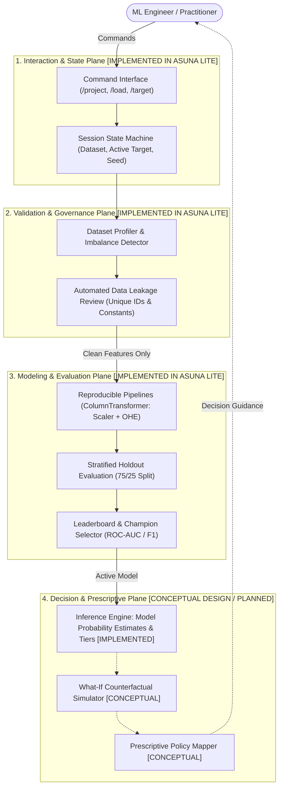
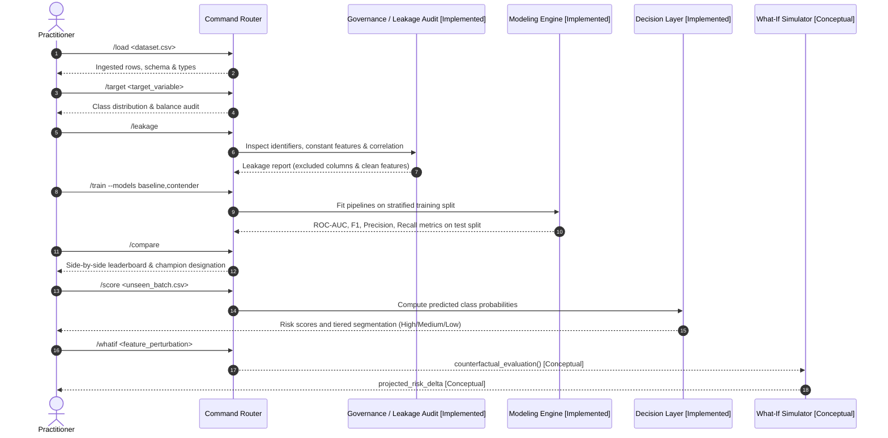

# Asuna ML Agent — Public Architecture Case Study

[](https://www.python.org/)
[](https://scikit-learn.org/)
[](https://github.com/DanteBurbano27/asuna-ml-agent/actions)
[](https://pytest.org/)
[](#system-architecture)

A public architecture case study, interaction design specification, and verified reference implementation for an applied machine learning lifecycle assistant.

---

## Important Repository Notice

> **Scope Clarification**: This repository is a public architecture case study and systems design document. It intentionally separates conceptual workflow design from the verified public reference implementation.
>
> - **Public Reference Scope**: This repository provides the verifiable architectural blueprint, command protocol specifications, data leakage audit methodology, and **Asuna Lite** (`asuna-lite/`), a fully reproducible reference implementation with automated tests.
> - **Conceptual / Planned Scope**: Advanced components such as interactive counterfactual what-if simulation, automated drift monitoring, and prescriptive policy solvers are documented as conceptual design specifications for future exploration.
>
> *Asuna Lite is a deliberately reduced public reference implementation demonstrating selected workflow concepts. It is not the private Asuna engine.*

---

## 1. System Architecture

The workflow separates applied predictive modeling into distinct execution planes, explicitly distinguishing what is verifiably implemented from conceptual design:



---

## 2. End-to-End Workflow Sequence

The system enforces strict sequence dependencies to guarantee reproducible outcomes and eliminate lookahead bias:



---

## 3. Design Decisions & Rationale

1. **Mandatory Pre-Training Leakage Audit**:
   - In tabular business problems, data leakage (e.g. including unique customer IDs or constant features) produces deceptive evaluation metrics.
   - Asuna enforces an explicit `/leakage` checkpoint before fitting models, isolating target proxies and constant features automatically.

2. **Reproducible Preprocessing Pipelines**:
   - Feature transformations are executed strictly inside Scikit-Learn `ColumnTransformer` (StandardScaler for numerical features, OneHotEncoder for categoricals) fitted exclusively on training data to prevent data snooping across splits.

3. **Predicted Class Probabilities & Tiered Decisioning**:
   - Rather than outputting uncalibrated binary classifications at arbitrary thresholds, the workflow produces model probability estimates mapped into actionable risk tiers (`High`, `Medium`, `Low`). This enables targeted operational interventions (e.g., proactive retention offers for high-risk accounts).

---

## 4. Asuna Lite — Public Reference Implementation

To provide concrete, verifiable evidence, this repository includes [`asuna-lite/`](asuna-lite/):

- **Core Package**: `asuna_lite.workflow.AsunaLiteWorkflow`
- **Capabilities Verified in Code**:
  - Synthetic tabular data generation (`generate_synthetic_telecom_data`)
  - Target assignment and class imbalance inspection
  - Automatic detection and exclusion of identifier columns and zero-variance features
  - Logistic Regression (baseline) vs. Random Forest (contender) comparison on a stratified holdout split
  - Batch inference with model probability estimates and operational risk tier assignment
- **Automated Tests**: 100% passing test suite using `pytest` (`asuna-lite/tests/test_workflow.py`).
- **CI Automation**: GitHub Actions CI workflow ([`.github/workflows/ci.yml`](.github/workflows/ci.yml)) testing on Python 3.10 and 3.11.

### Running Asuna Lite Locally
```bash
cd asuna-lite
pip install -r requirements.txt

# Run demonstration CLI
python -m asuna_lite.cli

# Run automated unit tests
pytest tests/ -v
```

---

## 5. Security & Privacy Rationale

- **Zero Sensitive Data in Repository**: All unit tests and demonstration scripts operate exclusively on deterministically generated synthetic data (`generate_synthetic_telecom_data`), guaranteeing zero exposure of private or proprietary data.
- **Explicit Direct Dependencies**: Direct imports (`numpy`, `pandas`, `scikit-learn`, `pytest`) are explicitly declared in `asuna-lite/requirements.txt` to eliminate transitive packaging assumptions.
- **Transparent Boundaries**: Unimplemented capabilities (what-if engines, drift solvers) are explicitly labeled as conceptual design specifications rather than claimed as live features.

---

## 6. System Limitations

- **Tabular Scope**: Designed primarily for structured tabular classification; text, audio, and image modalities require external feature extraction.
- **Reference In-Memory Processing**: `asuna-lite` executes in-memory using Pandas and Scikit-learn; distributed processing frameworks (e.g. Spark / Ray) are not part of this public reference implementation.
- **Human in the Loop**: The assistant provides structured audits and recommendations; causal validation and domain interpretation remain the practitioner's responsibility.

---

## Documentation Directory

- [`docs/architecture.md`](docs/architecture.md): Architectural planes, module breakdown, and implementation status.
- [`docs/commands.md`](docs/commands.md): Command specification across project, validation, training, and business layers.
- [`docs/technical_scope.md`](docs/technical_scope.md): Included vs. excluded capabilities and system boundaries.
- [`docs/roadmap.md`](docs/roadmap.md): Evolution timeline and public reference vs. conceptual milestones.
- [`examples/demo_session.md`](examples/demo_session.md): Annotated terminal walkthrough and sequence trace.

---

## Author

**Daniel Burbano** — Bogotá, Colombia  
- GitHub: [@DanteBurbano27](https://github.com/DanteBurbano27)  
- LinkedIn: [daniel-burbano-b93a1a313](https://www.linkedin.com/in/daniel-burbano-b93a1a313)
