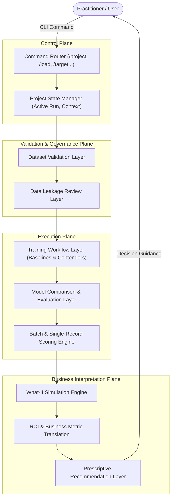

# Architecture Overview

Asuna ML Agent is designed as a structured, deterministic machine learning workflow assistant that guides practitioners through the applied ML lifecycle.

---

## Conceptual Architecture

---

## Key Conceptual Components

1. **Command Router**: Parses and validates input commands against the active project state.
2. **Project State Manager**: Tracks dataset references, target variable bindings, split configurations, and active candidate models.
3. **Dataset Validation Layer**: Inspects schemas, missing value patterns, and feature distributions.
4. **Leakage Review Layer**: Systematically screens for identifier columns, future-dated signals, and unnatural target correlations before training.
5. **Training Workflow Layer**: Orchestrates model training across reproducible pipelines (e.g. linear baselines vs. tree ensembles).
6. **Comparison Layer**: Evaluates contenders across balanced metrics (ROC-AUC, Precision, Recall, F1, Log-Loss).
7. **Scoring Workflow Layer**: Generates calibrated probability estimates for incoming records.
8. **What-If Analysis Layer**: Simulates perturbations to controllable features (e.g., pricing adjustments) to project outcome shifts.
9. **Prescriptive Layer**: Maps risk scores into recommended business interventions.

---

## Design Principles

- **Deterministic Execution**: Workflow commands execute sequentially with explicit prerequisites (e.g., target must be declared before leakage audit).
- **Business-First Metric Interpretation**: Model results are translated into decision thresholds and expected value, not just raw statistical metrics.
- **Leakage Prevention by Default**: Checks run before any model training to prevent deceptive benchmark results.
- **Reproducibility**: Parameter seeds, feature definitions, and data partitions are explicitly recorded.

---

## Public vs. Private Implementation Notice

This document describes the high-level architecture and design specifications. The private engine implementation, proprietary models, and internal prompts remain in a private enterprise repository. A simplified reference implementation is available in [`asuna-lite/`](../asuna-lite/).
