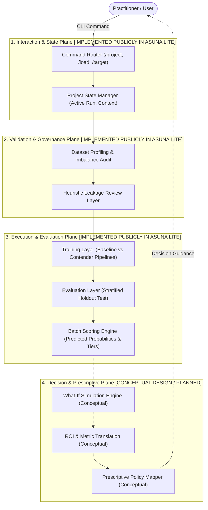

# Architecture Overview

Asuna ML Agent is an architectural case study for a structured machine learning workflow assistant that guides practitioners through the applied ML lifecycle.

---

## Architectural Planes & Implementation Status

---

## Component Classification

### Verified Public Reference Implementation (`asuna-lite/`)
1. **Command Router & State Manager**: Coordinates sequential execution (loading -> target binding -> audit -> fit -> compare -> score).
2. **Dataset Profiling**: Assesses shape, feature data types, and target class balance.
3. **Leakage Review Layer**: Flags identifier columns (cardinality ~1.0) and zero-variance features prior to model fitting.
4. **Training Workflow Layer**: Trains reproducible Scikit-Learn pipelines (`ColumnTransformer` with `StandardScaler` and `OneHotEncoder`) across Logistic Regression (baseline) and Random Forest (contender).
5. **Comparison Layer**: Evaluates contenders on a stratified holdout split across ROC-AUC, F1, Precision, and Recall.
6. **Scoring Layer**: Computes predicted class probabilities and assigns records into operational risk tiers (`High`, `Medium`, `Low`).

### Conceptual Design Specifications (Not Implemented in Code)
1. **What-If Simulation Engine**: Conceptual design for perturbing controllable input values (e.g. fee adjustments) to simulate score movement.
2. **Prescriptive Policy Mapper**: Conceptual rule mapping translating risk tiers into operational retention policies.
3. **Automated Drift Triggers**: Conceptual monitoring specifications for detecting population score shifts.

---

## Design Principles

- **Deterministic Execution**: Workflow commands execute sequentially with explicit prerequisites (e.g., target must be declared before leakage audit).
- **Leakage Prevention by Default**: Checks run before model fitting to prevent artificial validation inflation.
- **Reproducible Evaluation**: Preprocessing happens strictly inside pipelines on training splits, evaluated against a stratified test split.

---

## Public Reference Notice

> Asuna Lite is a deliberately reduced public reference implementation demonstrating selected workflow concepts. It is not the private Asuna engine.
