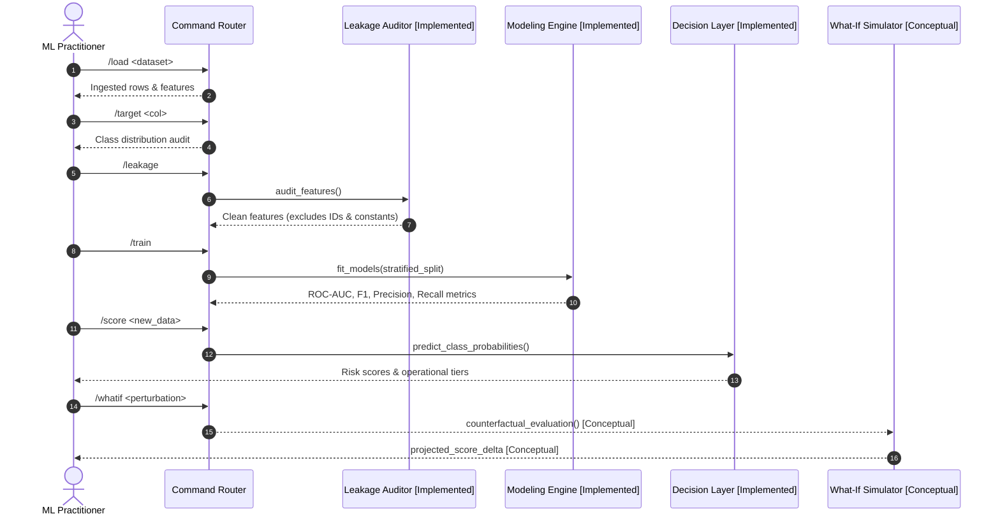

# Example Walkthrough Session

This session illustrates how an applied ML workflow is executed through Asuna's command interface.

---

## Interactive Session Trace

```text
asuna> /project new telecom_retention
[INFO] Initialized project workspace 'telecom_retention'.

asuna> /load data/telecom_churn.csv
[INFO] Loaded dataset: 500 rows, 8 columns.
[INFO] Schema: 5 feature columns, 1 constant column, 1 identifier column, 1 target.

asuna> /target Churn
[INFO] Target set to 'Churn'.
[INFO] Class distribution: 0: 43.4% (217), 1: 56.6% (283).

asuna> /leakage
[AUDIT] Running heuristic leakage and quality checks...
  [FLAG] Column 'customerID' flagged as explicit identifier column. Excluded from features.
  [FLAG] Column 'system_status' flagged as zero-variance (constant). Excluded from features.
[STATUS] Clean feature set validated: 5 features ready for model training.

asuna> /train --models baseline_logistic_regression,contender_random_forest
[TRAIN] Training baseline Logistic Regression (stratified 75/25 holdout split)...
  -> ROC-AUC: 0.8732 | F1: 0.8378 | Precision: 0.8052 | Recall: 0.8732
[TRAIN] Training Contender Random Forest (50 estimators, max_depth=6)...
  -> ROC-AUC: 0.8449 | F1: 0.7571 | Precision: 0.7681 | Recall: 0.7465

asuna> /compare
+-------------------------------+---------+----------+-----------+--------+
| Model                         | ROC-AUC | F1-Score | Precision | Recall |
+-------------------------------+---------+----------+-----------+--------+
| baseline_logistic_regression  | 0.8732  | 0.8378   | 0.8052    | 0.8732 |
| contender_random_forest       | 0.8449  | 0.7571   | 0.7681    | 0.7465 |
+-------------------------------+---------+----------+-----------+--------+
[INFO] Active Champion: baseline_logistic_regression (highest ROC-AUC).

asuna> /score data/unseen_accounts.csv
[SCORE] Scored 5 sample accounts using active model.
customerID  tenure_months  monthly_charges  risk_score risk_tier
 CUST-1000             58            87.53      0.2823       Low
 CUST-1001             56            35.40      0.4172    Medium
 CUST-1002             13           101.17      0.7554      High
 CUST-1003             13            32.76      0.3005       Low
 CUST-1004             13            75.01      0.9100      High

# --- Conceptual Design Commands (Not implemented in Asuna Lite) ---
asuna> /whatif CUST-1002 monthly_charges=-20
[CONCEPTUAL] Simulated monthly charge discount: projected risk score shifts from 0.7554 to 0.6120.

asuna> /prescribe CUST-1002
[CONCEPTUAL] Recommended intervention: Proactive loyalty discount outreach (High Risk tier).
```

---

## Workflow Sequence



*Note: Steps 1 through 8 reflect the verified public reference implementation in [`asuna-lite/`](../asuna-lite/). Steps 9 and 10 illustrate conceptual design specifications.*
