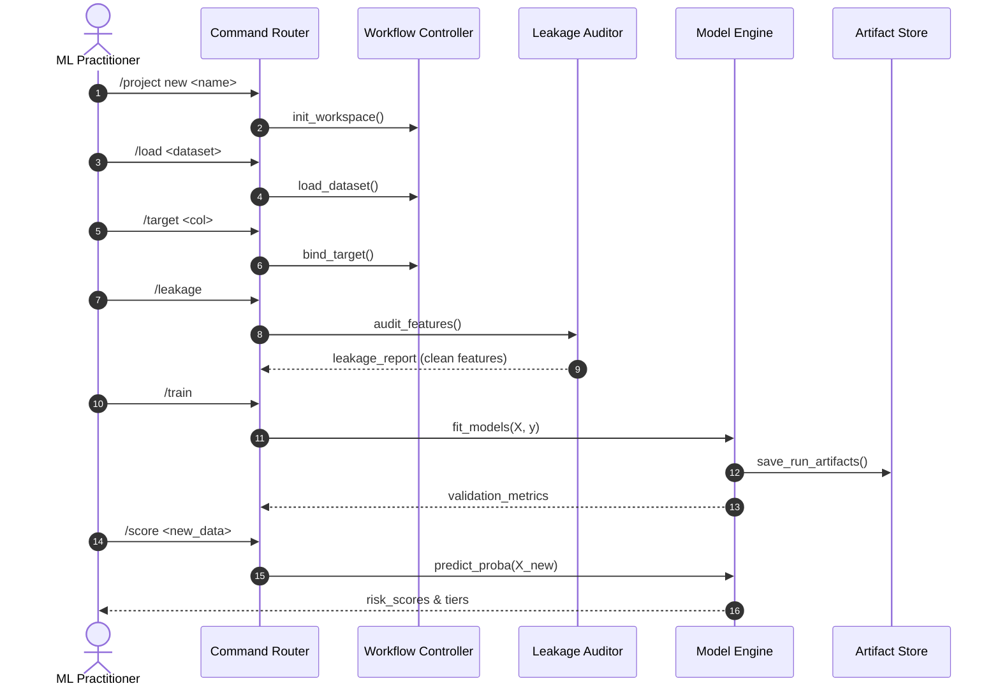

# Example Walkthrough Session

This session illustrates how an applied ML workflow is executed through Asuna's command interface.

---

## Interactive Session Trace

```text
asuna> /project new telecom_retention
[INFO] Initialized project workspace 'telecom_retention' at ./workspaces/telecom_retention.

asuna> /load data/telecom_churn.csv
[INFO] Loaded dataset: 7,043 rows, 21 columns.
[INFO] Schema: 16 categorical features, 4 numerical features, 1 identifier column.

asuna> /target Churn
[INFO] Target set to 'Churn'.
[INFO] Class distribution: 0: 73.5% (5,174), 1: 26.5% (1,869).
[WARN] Moderate class imbalance detected (ratio 2.77:1). Stratified evaluation recommended.

asuna> /leakage
[AUDIT] Running leakage and data quality checks...
  [FLAG] Column 'customerID' flagged as unique identifier (cardinality 100%). Excluded from features.
  [INFO] No target correlation > 0.85 detected in input features.
  [INFO] No future-dated feature timestamp violations detected.
[STATUS] Clean feature set validated: 19 features ready for model training.

asuna> /train --models logistic_regression,random_forest
[TRAIN] Training baseline Logistic Regression (stratified 5-fold CV)...
  -> ROC-AUC: 0.841 | F1: 0.589 | Precision: 0.652 | Recall: 0.538
[TRAIN] Training Random Forest (100 estimators, max_depth=8)...
  -> ROC-AUC: 0.849 | F1: 0.612 | Precision: 0.674 | Recall: 0.560
[INFO] Run saved as RUN-2026-002 (Random Forest).

asuna> /compare RUN-2026-001 RUN-2026-002
+----------------------+------------------+-------------------+
| Metric               | Run 001 (LogReg) | Run 002 (RandFor) |
+----------------------+------------------+-------------------+
| ROC-AUC              | 0.841            | 0.849 (+0.008)    |
| F1-Score (Threshold) | 0.589 (0.50)     | 0.612 (0.45)      |
| Precision            | 0.652            | 0.674             |
| Recall               | 0.538            | 0.560             |
+----------------------+------------------+-------------------+
[INFO] Recommended active model: RUN-2026-002.

asuna> /score data/unseen_accounts.csv
[SCORE] Scored 250 unlabelled accounts using RUN-2026-002.
[SUMMARY] High-risk tier (>70% prob): 38 accounts.
[SUMMARY] Medium-risk tier (40-70% prob): 64 accounts.
[SUMMARY] Low-risk tier (<40% prob): 148 accounts.
```

---

## Workflow Sequence



*Note: This session demonstrates the interaction design. A runnable subset of this workflow is implemented in [`asuna-lite/`](../asuna-lite/).*
